# Öğrenci Bilgi Sistemi

Bu proje, ASP.NET MVC yapısı kullanılarak kodlanmış ve web tabanlı olarak hazırlanmıştır. Nesne Yönelimli Programlama (OOP) prensiplerine göre geliştirilmiş olup, ilişkisel bir veritabanı kullanmaktadır.

## Proje Özellikleri

- Öğrenci ve öğretim elemanı kullanıcıları için ayrı ayrı paneller.
- Kullanıcı girişi ve yetkilendirme işlemleri.
- Öğrenciler için ders seçimi, not görüntüleme, transkript oluşturma gibi işlemler.
- Öğretim elemanları için ders programı, sınav notları girişi, danışmanlık işlemleri gibi özellikler.
- Responsive kullanıcı arayüzü.

## Veritabanı Tasarımı

Proje kapsamında aşağıdaki tablolar oluşturulmuştur:

| Tablo Adı        | Açıklama                                                  |
|------------------|-----------------------------------------------------------|
| Kullanici        | Otomasyona erişim yetkisi olan ve rolleri tanımlı kişiler  |
| Bolum            | Lisans programlarının kayıtlı olduğu akademik birimler    |
| Ogrenci          | Akademik programlarda kayıtlı olan kişiler                |
| OgretimElemani   | Akademik personel (Prof. Dr., Doç. Dr., vb.)              |
| Derslik          | Derslerin işlendiği yerler                                 |
| DersHavuzu       | Tüm derslerin yer aldığı tablo                             |
| Mufredat         | Bölümlere ait öğretim planları                             |
| DersAcma         | Açılan dersler                                             |
| DersAlma         | Öğrencilerin almış olduğu dersler                          |
| Sinav            | Sınav tanımları                                            |
| Degerlendirme    | Sınav notlarının girişi                                    |
| DersProgrami     | Haftalık ders çizelgeleri                                  |
| Danismanlik      | Öğretim elemanlarının danışman olduğu öğrenciler           |

## Kullanıcı Panelleri

### Öğrenci Paneli
- **Öğrenci Bilgileri:** Ad, Soyad, T.C. Kimlik No, Doğum Yeri ve Tarihi gibi kimlik bilgileri.
- **Ders Programı:** Öğrencinin haftalık ders programı.
- **Notlar:** Öğrencinin sınav notları.
- **Transkript:** Öğrencinin aldığı derslerin not dökümü.
- **Ders Kayıt:** Öğrencinin ders seçimi yapabileceği sayfa.

### Öğretim Elemanı Paneli
- **Kişisel Bilgiler:** Ad, Soyad, T.C. Kimlik No, Unvan gibi kimlik bilgileri.
- **Verilen Dersler:** Öğretim elemanının verdiği dersler.
- **Ders Programı:** Öğretim elemanının haftalık ders programı.
- **Sınav Tanımlama:** Derslerin sınavlarını tanımlama ve düzenleme.
- **Not Girişi:** Sınav sonuçlarını girme ve güncelleme.
- **Danışmanlık:** Danışmanlık yaptığı öğrencilerin listesi.

## Ekran Görüntüleri

### Öğrenci Paneli

1. **Özlük Bilgileri**
   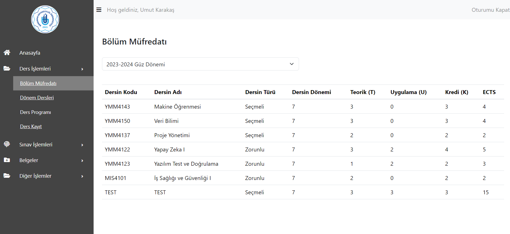
   
2. **Transkript**
   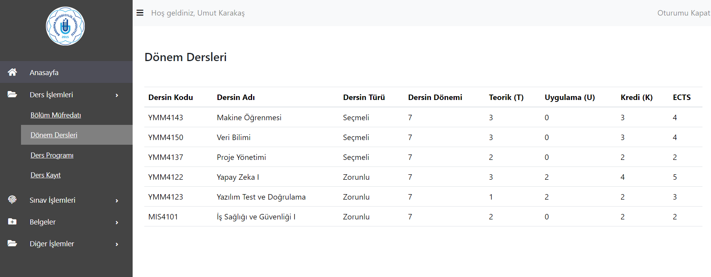
   
3. **Ders Programı**
   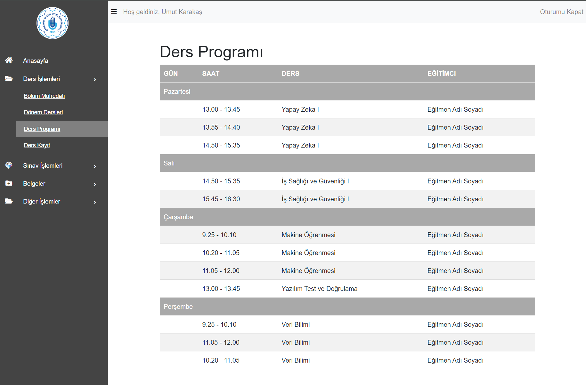
   
4. **Dönem Dersleri**
   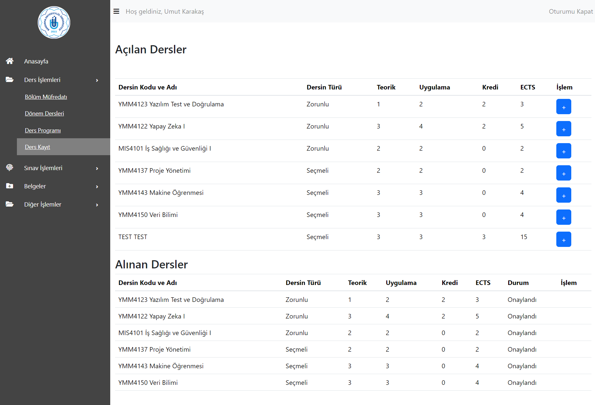
   
5. **Bölüm Müfredatı**
   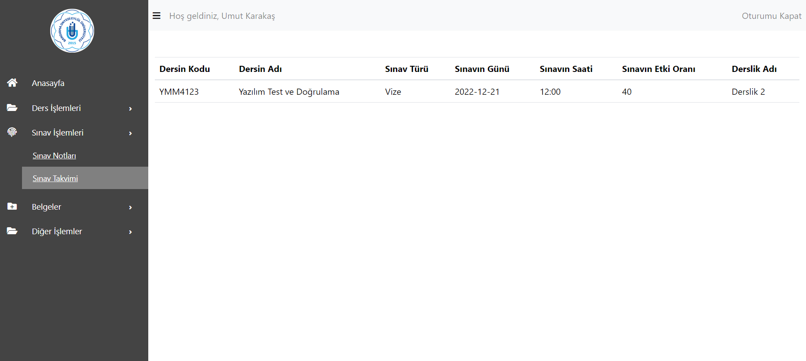
   
6. **Sınav Notları**
   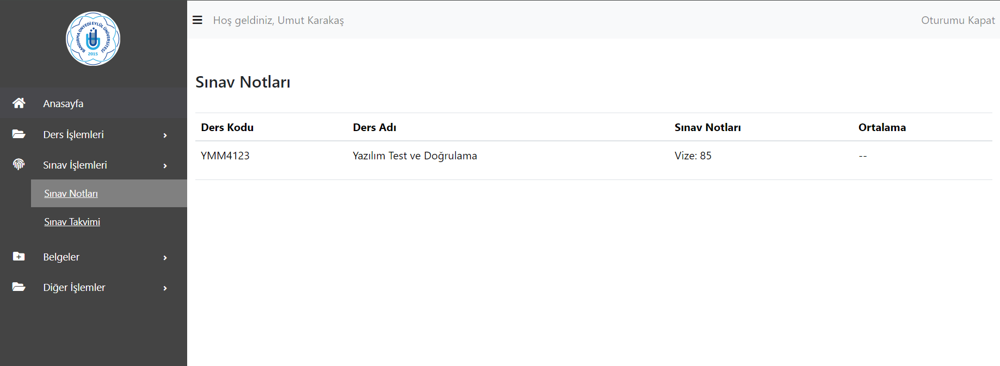
   
7. **Sınav Takvimi**
   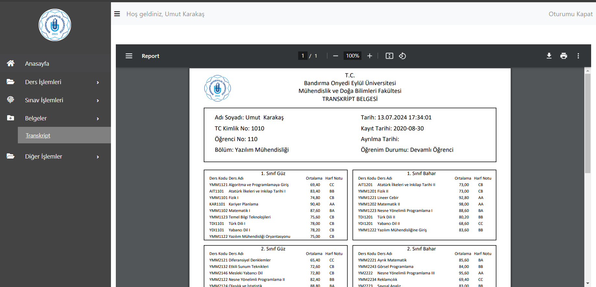
   
8. **Ders Kayıt**
   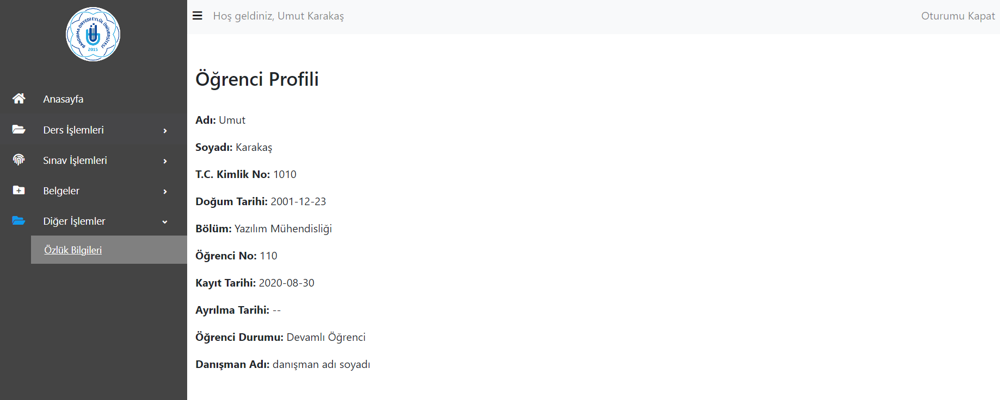

### Öğretim Elemanı Paneli

1. **Özlük Bilgileri**
   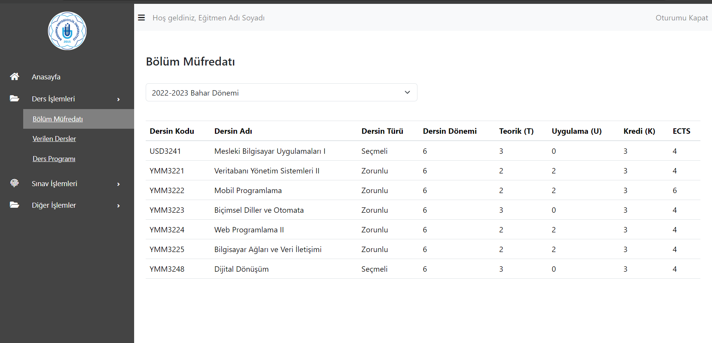
   
2. **Danışmanlık Yapılan Öğrenciler**
   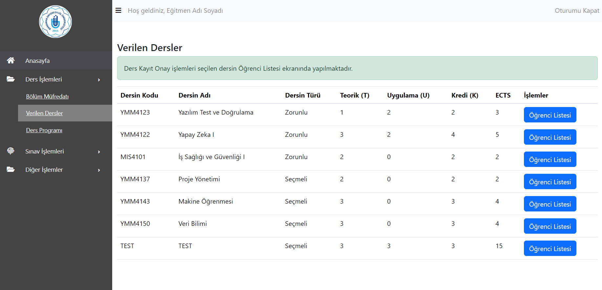
   
3. **Bölüm Müfredatı**
   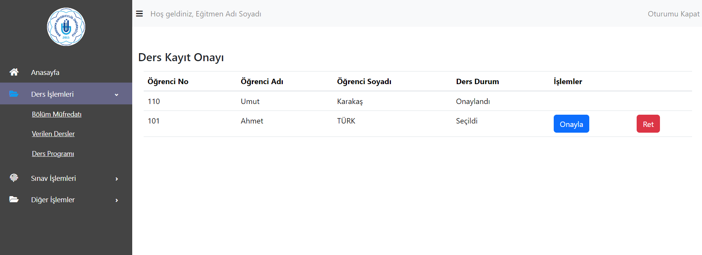
   
4. **Verilen Dersler**
   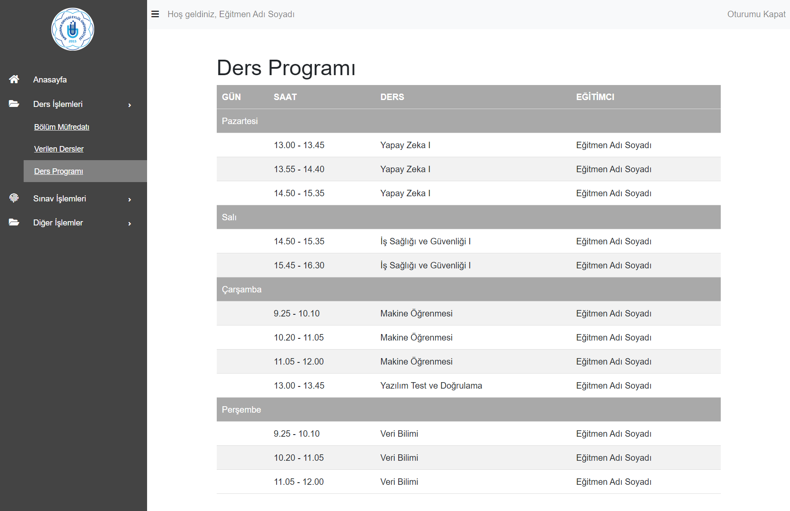
   
5. **Ders Kayıt Onayı**
   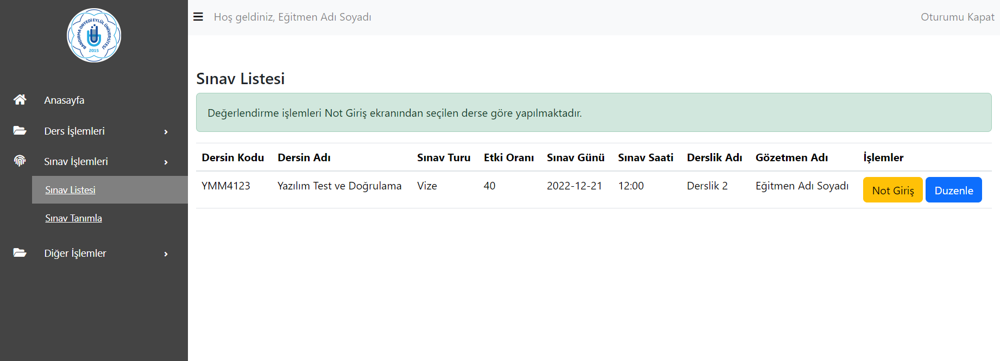
   
6. **Ders Programı**
   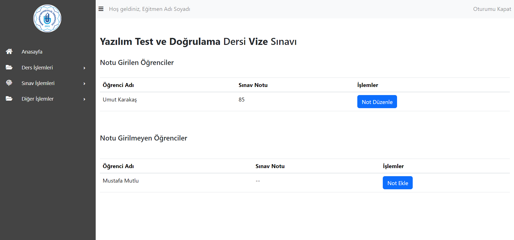
   
7. **Sınav Tanımlama**
   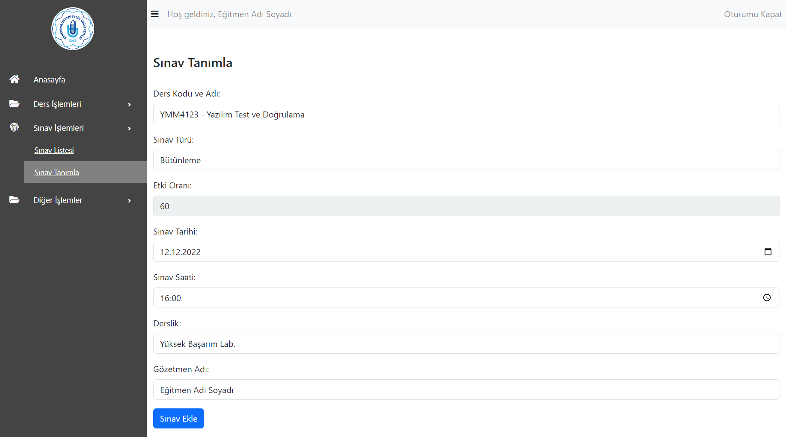
   
8. **Sınav Listesi**
   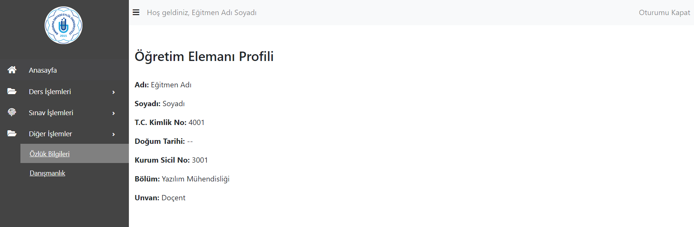
   
9. **Sınav Not Girişi**
   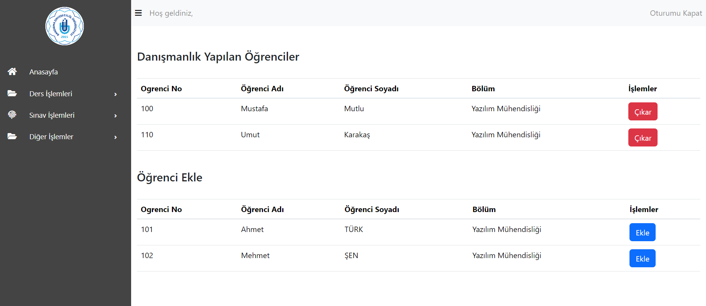
